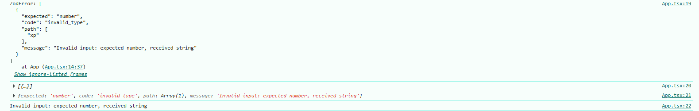

<h1 align="center">Zod Notes</h1>

- [Introduction:](#introduction)
  - [Installation:](#installation)
  - [Basic Usage:](#basic-usage)
    - [Defining a schema:](#defining-a-schema)
    - [Parsing data:](#parsing-data)
    - [Inferring types:](#inferring-types)
    - [Handling errors:](#handling-errors)


# Introduction: 
Zod is a TypeScript-first schema validation library used to define the shapes, validate, and infer types automatically of our data at runtime. TypeScript alone can just do compile time safety and just give us editor level runtime error suggestions, but Zod give us runtime safety + compile time safety (with ts). Zod is often used in scenarios like validating API requests, form inputs, or any other data that needs to be checked for correctness before being processed further. 

Without zod, blow code run perfectly and we won't get any error until we compile it with tsc.

```ts
type Player = {
    username: string;
    xp: number;
}

const input: Player = { username: "billie", xp: '100' };

console.log(input);
```

But with zod, now we get editor label error by ts + runtime error by zod: 

```ts
import * as z from "zod";

const PlayerSchema = z.object({
    username: z.string(),
    xp: z.number()
});

type PlayerType = z.infer<typeof PlayerSchema>;

const input: PlayerType = { username: "billie", xp: '100' };

const playerData = PlayerSchema.parse(input);

console.log(playerData);
```

```js
ZodError: [
  {
    "expected": "number",
    "code": "invalid_type",
    "path": [
      "xp"
    ],
    "message": "Invalid input: expected number, received string"
  }
]
```

## Installation: 

```bash
npm install zod
```

## Basic Usage:

### Defining a schema:
A schema is simply a blueprint that describes what valid data should look like.

```ts
import * as z from "zod"; 
 
const PlayerSchema = z.object({
    username: z.string(),
    xp: z.number()
});
```

### Parsing data:
use `.parse` to validate an schema input. If it's valid, Zod returns a strongly-typed deep clone of the input.

```ts
import * as z from "zod";

const PlayerSchema = z.object({
    username: z.string(),
    xp: z.number()
});

const input = { username: "billie", xp: '100' };

const playerData = PlayerSchema.parse(input);

console.log(playerData);
```

Note: now zod only give us runtime error, but if we want to get editor label error by ts, if we want editor label error by ts, we need to  use z.infer<> to extract the inferred type from our schema.


**Note:** If our schema uses certain asynchronous APIs like async refinements or transforms, we'll need to use the .parseAsync() method instead. 

```ts
await PlayerSchema.parseAsync(input); 
```

### Inferring types: 
Zod infers static type from our schema definitions as type alias by default. we can extract this type with the z.infer<> utility and use it as a normal type alias.

**Note:** For interface zod doesn't support to inter types, but type alisa are supported.

```ts
import * as z from "zod";

const PlayerSchema = z.object({
    username: z.string(),
    xp: z.number()
});

type PlayerType = z.infer<typeof PlayerSchema>

const input: PlayerType = { username: "billie", xp: '100' };

const playerData = PlayerSchema.parse(input);

console.log(playerData);
```

Now we get editor label error by ts + runtime error by zod.

Note: Zod infers static type form our schema definitions as type alias by default, to prove it we can see the below example: 

```ts
import * as z from "zod";

const PlayerSchema = z.object({
    username: z.string(),
    xp: z.number()
});


const input = { username: "billie", xp: '100' };

const playerData = PlayerSchema.parse(input);

console.log(playerData);
```

Now hover the input variable on vs code, then we can see the type of input is: 

```
const input: {
    username: string;
    xp: string;
}
```

### Handling errors:

```tsx
import * as z from "zod";

const App = () => {

  const PlayerSchema = z.object({
    username: z.string(),
    xp: z.number()
  });

  type PlayerType = z.infer<typeof PlayerSchema>

  const input: PlayerType = { username: "billie", xp: '100' };

  const playerData = PlayerSchema.parse(input);

  console.log(playerData);
  return (
    <div>
    </div>
  );
};

export default App;
```

To prevent our application from breaking, we can use try/catch block for with .parse() to catch the error and handle it gracefully, and if we don't want to use try/catch block, we can use .safeParse().


```ts
import * as z from "zod";

const App = () => {
  const PlayerSchema = z.object({
    username: z.string(),
    xp: z.number()
  });

  type PlayerType = z.infer<typeof PlayerSchema>

  const input: PlayerType = { username: "billie", xp: '100' };

  try {
    const playerData = PlayerSchema.parse(input);
    console.log(playerData);
  }
  catch (error) {
    if (error instanceof z.ZodError) {
      console.log(error)
      console.log(error.issues)
      console.log(error.issues[0])
      console.log(error.issues[0].message)
    }
  }
  return (
    <div>
      hi
    </div>
  );
};

export default App;
```

here, 
- error: gives the error as ZodError instance, but we can't show it directly by ui for users.
- error.issues: gives the error as array of objects, each object contains the details of the error.
- error.issues[0]:  gives the first error object here we can find all commonly used important errors

 


for .safeParse(): 

```tsx
import * as z from "zod";

const App = () => {
  const PlayerSchema = z.object({
    username: z.string(),
    xp: z.number()
  });

  type PlayerType = z.infer<typeof PlayerSchema>

  const input: PlayerType = { username: "billie", xp: '100' };

  const result = PlayerSchema.safeParse(input);

  if (!result.success) {
    console.log(result.error)
    console.log(result.error.issues)
    console.log(result.error.issues[0])
    console.log(result.error.issues[0].message)
  } else {
    console.log(result.data)
  }
  return (
    <div>
      hi
    </div>
  );
};

export default App;
```

Note: If our schema uses certain asynchronous APIs like async refinements or transforms, we'll need to use the .safeParseAsync() method instead.
